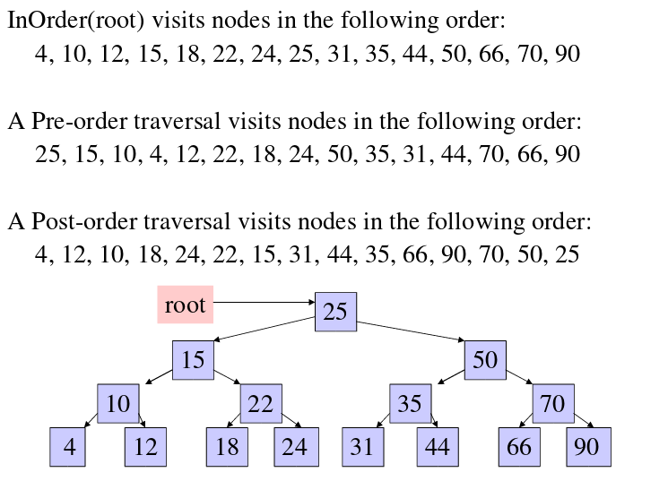

## Tree
- A tree is actually a type of graph.
- Each tree has a root node. The root node has zero or more child nodes.
- Cannot contain cycles
- Nodes may or may not be in a particular order
- Can have any data types as values

### What is a BST?
- All left descendants of root are less than or equal to root. All right descendants of root are greater than or equal to root.
- Definition varies slightly with respect to equality. The following are various valid definitions, but be sure to clarify with interviewer.
    - tree cannot have duplicate values
    - duplicate values will be on the right side of root
    - duplicate values will be on the left side of root

### Types of Trees
- complete
    - every level of the tree is fully filled, except for the last level. If last level is filled, it is filled from left to right.
- full
    - nodes have either zero or two children. No nodes have only one child.
- perfect
    - a tree that is both full and complete.
- balanced
    - height of left and right subtrees of any node never differ by more than one
- unbalanced

### Types of Traversal
- **in-order (most widely used)**
    - If traversing a **BST**, touches all nodes in order from least to greatest.
    - traverse to the lowest level along left branch, touches left child, then root node of that sub-tree, then right node of sub-tree, and works its way back up to top node.

    - Implementation
        1. traverse left subtree (i.e. call in_order(left_subtree))
        2. visit root
        3. traverse right subtree (i.e. call in_order(right_subtree))

- **pre-order**
    - touches top node first, then traverses left branch, **touching every left child until it reaches the bottom,** then touches the right child of each sub-tree along left branch, working its way back up to top node.
    - traverses the right branch of BST, and repeats traversal pattern done on left branch.

    - Implementation
        1. visit root
        2. traverse left subtree (i.e. call pre_order(left_subtree))
        3. traverse right subtree( i.e. call pre_order(right_subtree))

- **post-order**  
    - first touches lowest level of left branch, touching left child of each sub-tree, right child of each sub-tree, then parent node of each sub-tree.
    - Then touches lowest level of right branch, touching left child of each sub-tree, right child of each sub-tree, then parent node of each sub-tree, finally reaching the top node of original BST.
    - great for safely deleting nodes from a BST because it starts from the lowest level and works its way up.

    - Implementation
        1. traverse left subtree (i.e. call post_order(left_subtree))
        2. traverse right subtree (i.e. call post_order(right_subtree))
        3. visit root

- Example 1:

    - in_order (left, root, right): 4 2 5 1 3
    - pre_order (root, left, right): 1 2 4 5 3
    - post_order (left, right, root): 4 5 2 3 1

- Time Complexity: O(n), where n is number of nodes
- Space Complexity: O(1) if we don't consider size of stack for function calls, otherwise O(n)

- Example 2:

### What you need to know about BSTs

- #find() - log(n) time
- #insert() - log(n) time
- #delete() - log(n) time

    - kth largest node
        - keep a count
        - keep reference to correct node

### Algorithms
- Examples:

    1. maximum_depth_of_binary_tree(root)
        class Node
            def initialize

            end
        - return 0 if root has no children
            `return 0 if root.right.nil? && root.left.nil?`
        - initialize a depth_counter
        -
